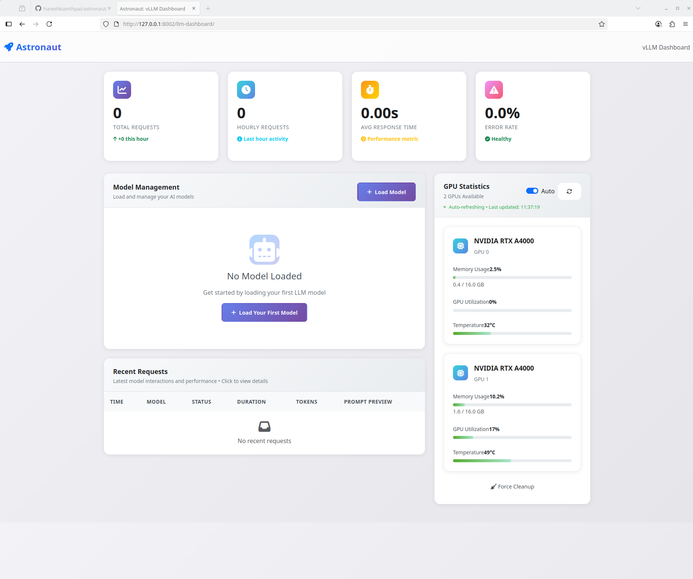
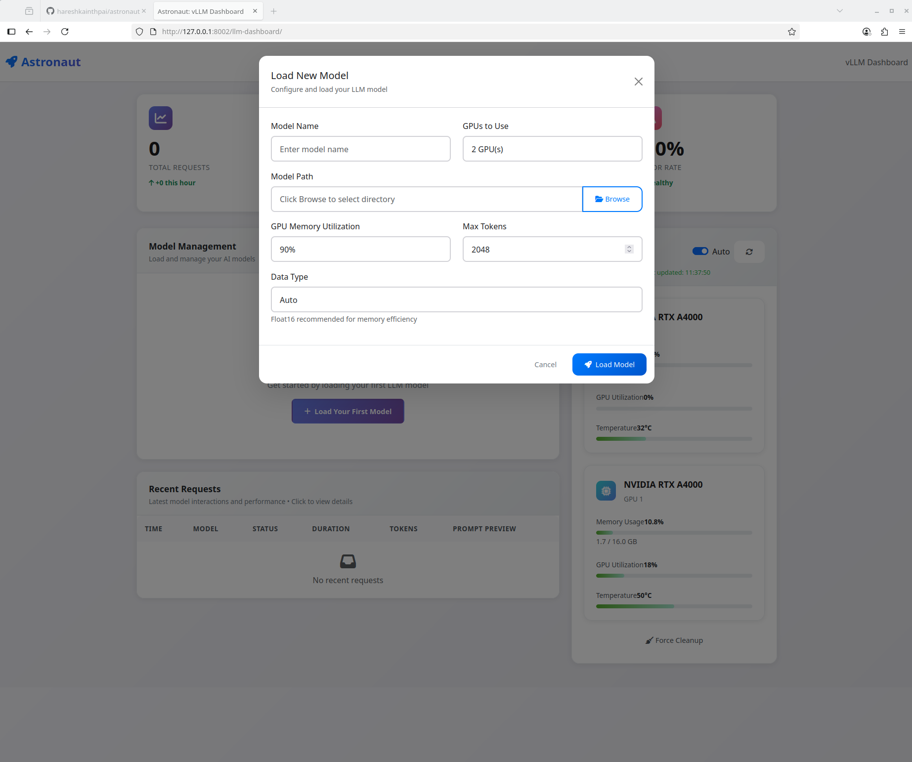
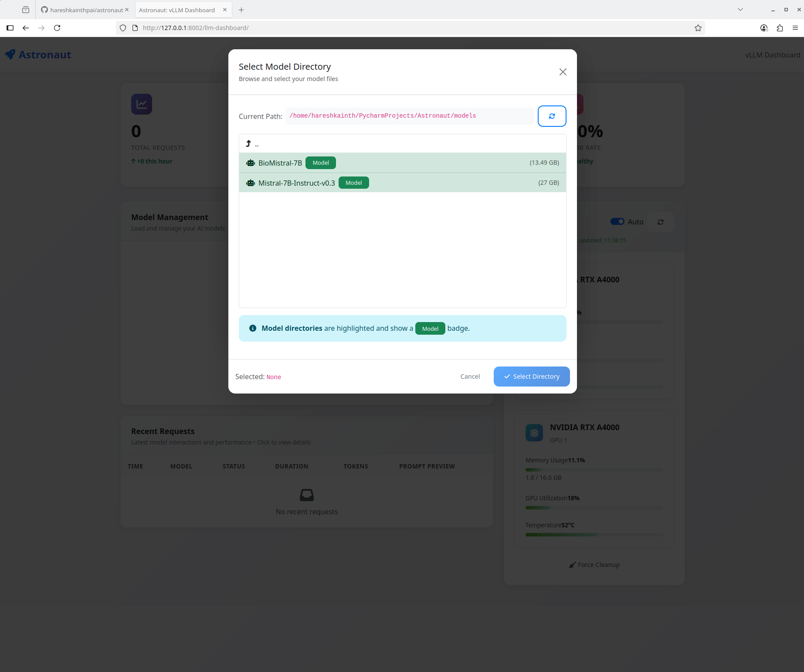

# Astronaut - LLM Dashboard Service

A Django-based web service for managing and serving Large Language Models (LLMs) using vLLM backend with enhanced CUDA stability and multi-GPU support.

## Dashboard Overview



## Features

### Model Details



### Model Selection



## Overview

Astronaut is a comprehensive LLM management platform that provides:

- **Model Management**: Load, unload, and manage multiple LLM models
- **vLLM Integration**: Robust vLLM server orchestration with CUDA optimizations
- **Multi-GPU Support**: Efficient tensor parallelism for large models
- **Real-time Monitoring**: Live logs and status tracking for model operations
- **OpenAI-Compatible API**: Standard API endpoints for text generation
- **Request Tracking**: Detailed logging of all model requests and responses


## How to start the service (developer)

### Option 1: Complete clean restart
make force-restart

or 

make setup

### Option 2: Kill everything first, then build
make kill-all
make docker-build

### Option 3: Just kill containers and restart
make kill-docker
make docker-build

### ## For development (non-Docker) 

#### Kill ports and start development server
make kill-ports
make dev-start


## Features

### Core Capabilities
- **Dynamic Model Loading**: Load models from local paths or Hugging Face
- **GPU Memory Management**: Intelligent memory utilization and cleanup
- **Multi-GPU Scaling**: Automatic tensor parallelism configuration
- **Health Monitoring**: Real-time server health checks and diagnostics
- **Error Recovery**: Robust error handling and recovery mechanisms

### Technical Features
- **CUDA Stability**: Enhanced CUDA environment configuration
- **Process Management**: Proper process lifecycle management
- **Memory Optimization**: Advanced GPU memory cleanup and optimization
- **Concurrent Operations**: Support for multiple simultaneous model operations
- **Logging System**: Comprehensive logging with real-time updates

## Models

### LLMModel
The core model for managing LLM instances with the following key fields:
- `name`: Model identifier
- `model_path`: Local path or Hugging Face model ID
- `status`: Current state (LOADED, LOADING, ERROR, UNLOADED)
- `vllm_port`: Port for vLLM server
- `tensor_parallel_size`: Number of GPUs to use
- `gpu_memory_utilization`: GPU memory utilization ratio
- `max_tokens`: Maximum token limit
- `dtype`: Model data type (auto, float16, bfloat16, float32)
- `loading_logs`: Real-time loading logs

### LLMRequest
Tracks individual requests to models:
- `model`: Associated LLM model
- `prompt`: Input prompt
- `response`: Generated response
- `duration`: Request processing time
- `tokens_generated`: Number of tokens generated
- `temperature`: Generation temperature
- `top_p`: Top-p sampling parameter
- `max_tokens`: Maximum tokens for this request

## Services

### VLLMService
The main service class that handles:

#### Model Operations
- `start_vllm_server()`: Start vLLM server with CUDA optimizations
- `stop_vllm_server()`: Stop server and clean up GPU memory
- `is_server_running()`: Check server health status

#### Text Generation
- `generate_text()`: Generate text using OpenAI-compatible API
- `get_model_info()`: Retrieve model information

#### System Management
- `_check_cuda_environment()`: Validate CUDA setup
- `_force_gpu_memory_cleanup()`: Force GPU memory cleanup
- `_wait_for_server_ready()`: Wait for server initialization

## Installation

1. **Clone the repository**
   ```bash
   git clone <repository-url>
   cd Astronaut
   ```

2. **Install dependencies**
   ```bash
   pip install -r requirements.txt
   ```

3. **Set up database**
   ```bash
   python manage.py makemigrations
   python manage.py migrate
   ```

4. **Run the server**
   ```bash
   python manage.py runserver
   ```

## Configuration

### CUDA Environment
The service automatically configures CUDA environment variables for optimal performance:
- `CUDA_VISIBLE_DEVICES`: GPU device selection
- `TORCH_NCCL_ASYNC_ERROR_HANDLING`: NCCL error handling
- `VLLM_ATTENTION_BACKEND`: Attention backend selection
- `PYTORCH_CUDA_ALLOC_CONF`: Memory allocation configuration

### Model Configuration
Models can be configured with:
- **Single GPU**: Simple configuration for small models
- **Multi-GPU**: Ray-based distributed inference for large models
- **Memory Optimization**: Configurable GPU memory utilization
- **Data Types**: Support for multiple precision levels

## Usage

### Basic Model Management
```python
from llm_dashboard.models import LLMModel
from llm_dashboard.services.vllm_service import vllm_service

# Create a model
model = LLMModel.objects.create(
    name="my-model",
    model_path="/path/to/model",
    vllm_port=8000,
    tensor_parallel_size=1
)

# Start the model
vllm_service.start_vllm_server(model)

# Generate text
result = vllm_service.generate_text(
    model=model,
    prompt="Hello, world!",
    max_tokens=100
)
```


## License

This project is licensed under the Creative Commons Attribution-NonCommercial 4.0 International License.

[](https://creativecommons.org/licenses/by-nc/4.0/)

### You are free to:
- **Share** — copy and redistribute the material in any medium or format
- **Adapt** — remix, transform, and build upon the material

### Under the following terms:
- **Attribution** — You must give appropriate credit, provide a link to the license, and indicate if changes were made
- **NonCommercial** — You may not use the material for commercial purposes without explicit permission

For commercial use, please contact **haresh@pixelcode.uk** for licensing terms.
